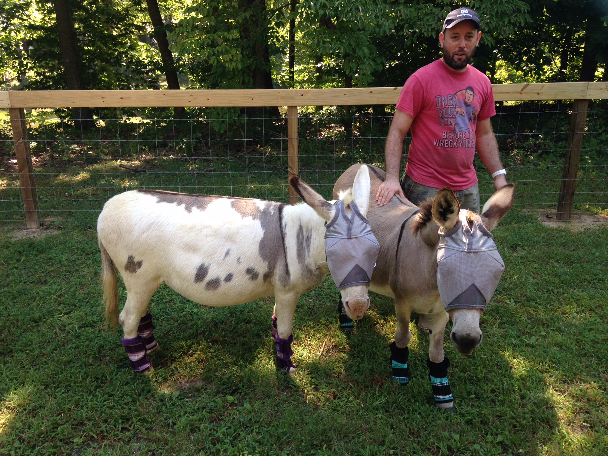

# Fulbright-Nehru Lectures
## 00 Linux API Development Workshop

Chancellor T. Pascale
Fulbright-Nehru
Summer 2022

-------------------------------
# Hello!

- Who am I?
- Workshop Goals
- Workshop Schedule

-------------------------------

# Who am I?

- Chancellor Pascale
- Software Developer
- Graduate Instructor in the Johns Hopkins University Whiting School of Engineering

-------------------------------

# Workshop Goals

- Supplement your academic studies
- Learn software development processes
- Develop a real world linux C++ application

-------------------------------

# Workshop Schedule Overall

- Week 1 Design and Sprint
- Week 2 Linux Development
- Week 3 Software Dev, Test, and Docs

-------------------------------

# Week 1 Design and Sprint
## Monday July 4

- 0830 - 0900 Workshop Inauguration
- 0915 - 0945 Introduction and Overview
- 0945 - 1000 [Agile Development Methods and Project Management](lecture-slides-01-01.md)
- 1000 - 1030 [Create Teams](lecture-slides-02-01.md)
- 1030 - 1050 Break
- 1050 - 1115 [Google Sprint Day 1: Map and Choose Target](lecture-slides-03-01.md)
- 1115 - 1300 Google Sprint

-------------------------------

# Week 1 Design and Sprint
## Tuesday July 5

- 0830 - 0845 [General Principles of UX](lecture-slides-04-01.md)
- 0845 - 0900 [Google Sprint Day 2: Sketch](lecture-slides-05-01.md)
- 0900 - 1030 Google Sprint
- 1030 - 1050 Break
- 1050 - 1300 Google Sprint

-------------------------------

# Week 1 Design and Sprint
## Wednesday July 6

- 0830 - 0845 Recap and Prepare
- 0845 - 0900 [UI Design and Wireframes](lecture-slides-06-01.md)
- 0900 - 0915 [Google Sprint Day 3: Decision](lecture-slides-07-01.md)
- 0915 - 1030 Google Sprint - Decide
- 1030 - 1050 Break
- 1050 - 1300 Google Sprint - Storyboard

-------------------------------

# Week 1 Design and Sprint
## Thursday July 7

- 0830 - 0845 Recap and Prepare
- 0845 - 0900 [Components and Reuse](lecture-slides-08-01.md) and [Component-based Development](lecture-slides-26-01.md)
- 0900 - 0915 [Google Sprint Day 4: Prototype](lecture-slides-09-01.md)
- 0915 - 1030 Google Sprint - Prototype
- 1030 - 1050 Break
- 1050 - 1300 Google Sprint - Prototype and prepare for User Testing

-------------------------------

# Week 1 Design and Sprint
## Friday July 8

- 0830 - 0845 Recap and Prepare
- 0845 - 0900 [Google Sprint Day 5: Test](lecture-slides-1-01.md)
- 0900 - 1030 Google Sprint - Interviews (30 minutes with 3 users)
- 1030 - 1050 Break
- 1050 - 1245 Google Sprint - Learn (combine notes, identify big issues)
- 1245 - 1300 [UI Frameworks](lecture-slides-10-01.md)

-------------------------------

# Week 2 Linux Development
## Monday July 11

- 0830 - 0845 [Git](lecture-slides-14-01.md)
- 0845 - 0900 Recap and Sprint Planning
- 0900 - 1250 Development
- 1250 - 1300 [Package Management](lecture-slides-12-01.md)
- 1300 - 1330 Lunch Break
- 1330 - 1415 Development
- 1415 - 1430 End of day demo

-------------------------------

# Week 2 Linux Development
## Tuesday July 12

- 0830 - 0845 [Shells and Environment Variables](lecture-slides-13-01.md)
- 0845 - 0900 Scrum
- 0900 - 1250 Development
- 1250 - 1300 [Basic linux commands](lecture-slides-15-01.md)
- 1300 - 1330 Lunch Break
- 1330 - 1415 Development
- 1415 - 1430 End of day demo

-------------------------------

# Week 2 Linux Development
## Wednesday July 13

- 0830 - 0845 [Threads and System performance](lecture-slides-16-01.md) *
- 0845 - 0900 Scrum
- 0900 - 1250 Development
- 1250 - 1300 [Linux services](lecture-slides-17-01.md) *
- 1300 - 1330 Lunch Break
- 1330 - 1415 Development
- 1415 - 1430 End of day demo

-------------------------------

# Week 2 Linux Development
## Thursday July 14

- 0830 - 0845 [Executables and libraries](lecture-slides-19-01.md)
- 0845 - 0900 Scrum
- 0900 - 1250 Development
- 1250 - 1300 [Documentation](lecture-slides-21-01.md) *
- 1300 - 1330 Lunch Break
- 1330 - 1415 Development
- 1415 - 1430 End of day demo

-------------------------------

# Week 2 Linux Development
## Friday July 15

- 0830 - 0845 [Testing](lecture-slides-22-01.md)
- 0845 - 0900 Scrum
- 0900 - 1300 Development
- 1300 - 1330 Lunch Break
- 1330 - 1415 Development
- 1415 - 1430 End of day demo

-------------------------------

# Week 3 Software Dev, Test, and Docs
## Monday July 18

- 0830 - 0845 [Build tools](lecture-slides-20-01.md)
- 0845 - 0900 Recap and Sprint Planning
- 0900 - 0915 Testing Leads Meeting
- 0900 - 1145 Development
- 1145 - 1200 End of day demo

-------------------------------

# Week 3 Software Dev, Test, and Docs
## Tuesday July 19

- 0830 - 0845 [Code Quality Metrics](lecture-slides-23-01.md) *
- 0845 - 0900 Scrum
- 0900 - 0915 Testing Leads Meeting
- 0900 - 1145 Development
- 1145 - 1200 End of day demo

-------------------------------

# Week 3 Software Dev, Test, and Docs
## Wednesday July 20

- 0830 - 0845 [DevOps](lecture-slides-23-01.md) *
- 0845 - 0900 Scrum
- 0900 - 0915 Testing Leads Meeting
- 0900 - 1145 Development
- 1145 - 1200 End of day demo

-------------------------------

# Week 3 Software Dev, Test, and Docs
## Thursday July 21

- 0830 - 0845 [C Package/Application distribution](lecture-slides-25-01.md)
- 0845 - 0900 Scrum
- 0900 - 1145 Development
- 1145 - 1200 End of day demo

-------------------------------

# Week 3 Software Dev, Test, and Docs
## Friday July 22

- 0830 - 0845 Scrum
- 0900 - 1130 Development
- 1130 - 1200 Lightning component presentations, overall current state of application plans, and final thoughts
