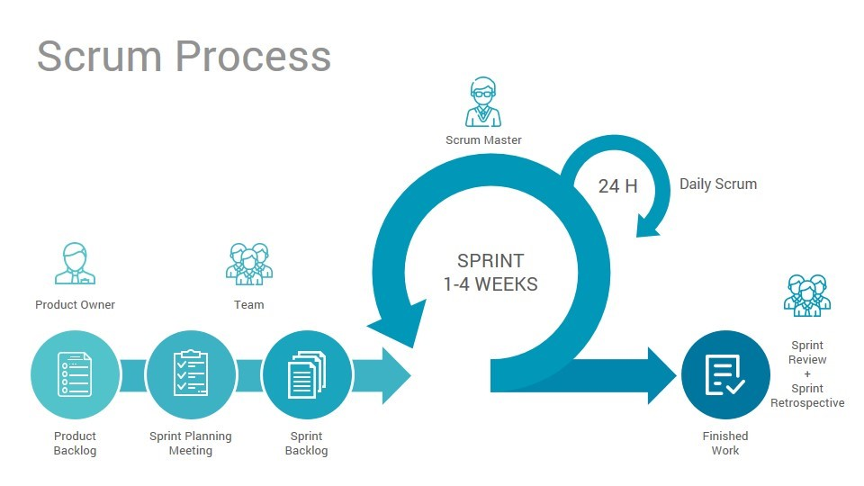

## Fulbright-Nehru Lecture 01 Agile Development Methods and Project Management

Chancellor T. Pascale
Fulbright-Nehru
Summer 2022

-------------------------------
### <!--fit--> Software Development Processes

- Waterfall
- Modified Waterfall
- Scrum
- Spiral
- Agile

-------------------------------

### Waterfall

-------------------------------

### Modified Waterfall

-------------------------------

 1

-------------------------------

### Spiral

-------------------------------

### Agile

-------------------------------
## Bibliography

1. [Blog 4 Geeks - Scrum for Digital Product Development](https://blog.4geeks.io/scrum-for-digital-product-development/)
2. [ETERNAL SUNSHINE OF THE IS MIND](https://eternalsunshineoftheismind.files.wordpress.com/2013/02/i-s-spiral.jpg)