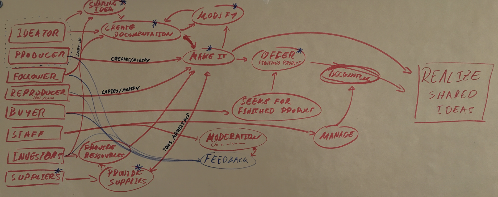
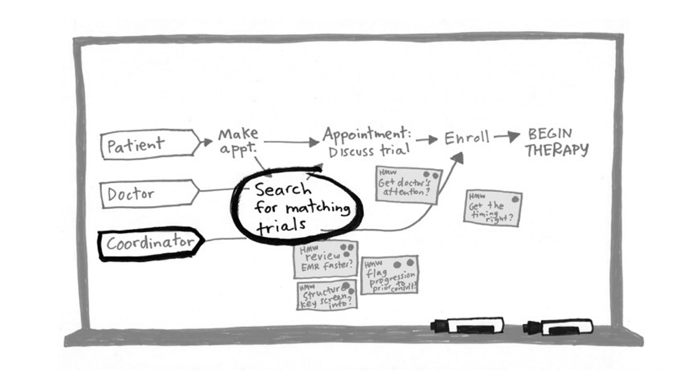

# Fulbright-Nehru Lectures
## 03 Map and Choose Target

Chancellor T. Pascale
Fulbright-Nehru
Summer 2022

-------------------------------

# How this will work (and each other day of this sprint)

- Each team works independently
- We are working with 1/2 the time so be efficient
- If you are stuck ask each other questions and then ask a facilitator
- At the end of the sprint day, each team will share their general progress
- Take breaks when you need them

<!-- Yet again don't worry we can do this we will end up with a design, we always can continue this -->
<!-- We are trying to get the best of the best so at certain points we may step in as the uber product owner and help out -->

-------------------------------
# General Principles

- Start at the End
- Map
- Ask the Experts
- Target

<!-- Pay attention to the steps of the process but if a specific detail doesn't work let's see if we can get around it -->

-------------------------------

# Start at the end

- Ask each other:
    > "Why are we doing this project? Where do we want to be in six months, a year or even five years from now?" [1]
- Collect sprint questions, taking into account what are the short to long term results
- Consider what are reasonable answers to these questions

<!-- Really focus in on where you want to be and not how you will get there -->
<!-- Don't think in the context of what you currently know, you will often find solutions outside of your current skills -->

-------------------------------

# Map

- You are going to make map of the use of your component
- Take the following steps [1]:
    1. List the actors (on the left)
    2. Write the ending (on the right)
    3. Words and arrows in between - focus on it being functional
    4. Keep it simple
    5. Ask for help

<!-- Don't worry about how it looks, just what it conveys -->
<!-- Do your best to be neutral, but care about what you are doing -->

-------------------------------

# Ask the experts

- Ensure that the decider, a user/user-facing person, a strong dev, and someone with some experience all are present
- Describe the sprint, go over what you have mapped on the whiteboards (just 1-2 minutes)
- Let the expert(s) give you as much information as they have
- Ask questions - taking good notes
- Update your whiteboards
  - Put your notes on stickies
  - Organize/Group stickies 
  - Vote up questions (everyone gets 2 votes except the decider who gets 4)
  - Put the most popular questions on the map, placing them closest to where they fit in

<!-- We may go round robin and ask other team's members to help out -->
<!-- Don't be afraid to ask questions -->

-------------------------------

# Target

- Decide which user and event you plan to target
- Go back to sprint questions and highlight the question that this event is answering
- You now have a target for your prototype for the end of the week

<!-- The goal here is to take your big hairy overall goal and narrow it down to a major step to it -->
<!-- Remember the end of this week you will have a prototype not a finished design -->
<!-- And at the end of 3 weeks you will have made progress and created a foundation, not an MVP or finished product -->

-------------------------------

# Bibliography

1. Knapp, J. Sprint; Penguin Books: London, 2021. 