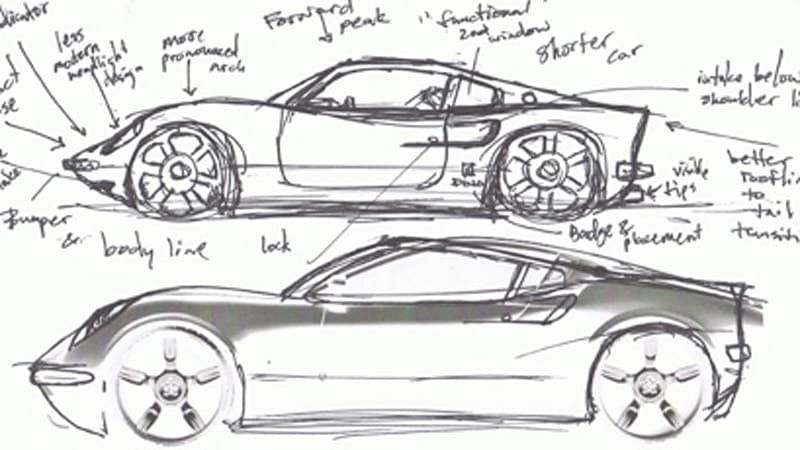
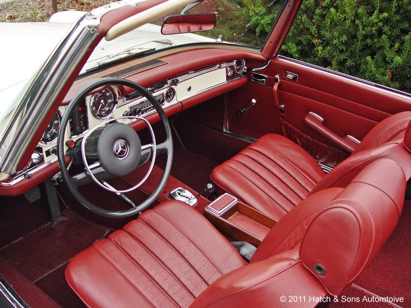
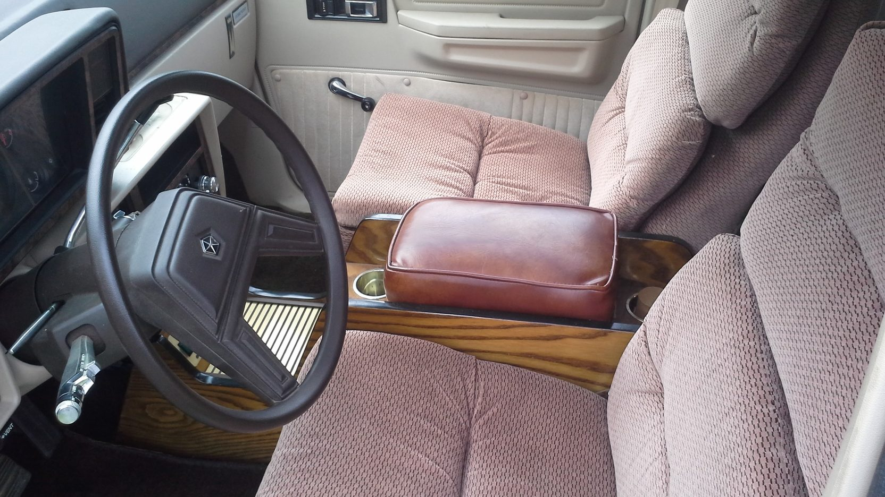
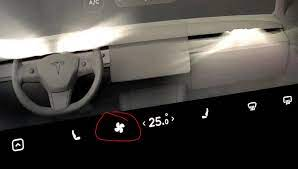
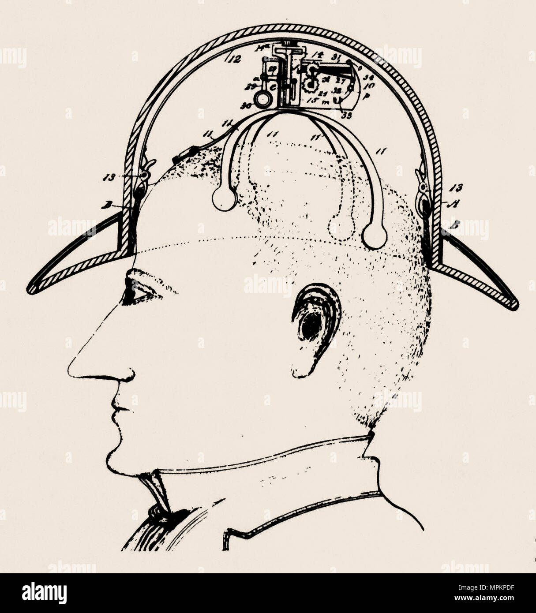
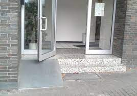

# Fulbright-Nehru Lectures
## 04 UX General Principles

Chancellor T. Pascale
Fulbright-Nehru
Summer 2022

-------------------------------

# Major UX Principles

- Put the User in the Center
- Context is King
- Users need control
- Consistency
- A Simple Design is often A Good Design
- Other Principles

[1]

-------------------------------

# Put the User in the Center

[1]
- Listen to your users
- Have empathy for users, reduce your bias
- Take into account what users are strong and weak at
- If you are trying to target specific users then find proxies

-------------------------------

# Context is King

- Understand users' environments
- Why are students using your application?
- What are users' constraints?
- It might be helpful to emulate the user and see what you app is like

[2]

-------------------------------

# Users need control

- Allow users to clearly understand what they control
- Give them preferences for how the application looks
- If there is a common set of steps create a shortcut
- History and undo and redo, allow users to safely fail
 
[3]
-------------------------------

# Consistency

- The experience shouldn't change if inputs don't change
- Reuse components throught out a design
- Reuse patterns and frameworks that users like in other contexts

<!-- Make it easy to change all similar content uniformly -->
<!-- Use system controls as intended -->
[1]

-------------------------------

# A Simple Design is Often a Good Design

- Choose the simplest solution
  - Easier for users to grasp
  - Easier to maintain
- Less clutter helps with focus
- Tools should be as self-evident as possible

-------------------------------

# Other UX Principles

- Usability First
- Hierarchical Design
- Test Accessibility
- Never jump straight into a high-fidelity prototype

[1]

-------------------------------

# Bibliography

1. UX design principles for a great user experience. https://www.justinmind.com/ux-design/principles (accessed Apr 27,  2022).
2. Team, 99designs. The 7 principles of UX Design-and how to use them. https://99designs.com/blog/web-digital/ux-design-principles/ (accessed Apr 27,  2022).
3. Lazaro Ibanez. User experience: Jakob Nielsen's 10 general principles for interaction design. https://lazaroibanez.com/user-experience-jakob-nielsens-10-general-principles-for-interaction-design-2593b0b53ddc (accessed Apr 27,  2022).
4. https://www.topgear.com/car-news/list/top-gears-top-9-best-classic-car-interior-edition
5. https://www.mecum.com/lots/DA0914-193223/1984-dodge-caravan/