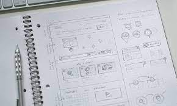
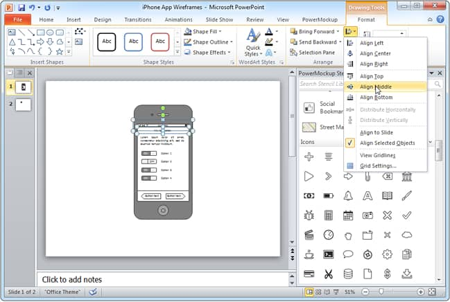
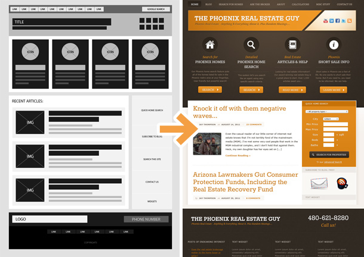
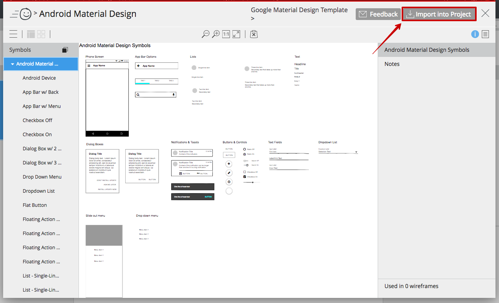

# Fulbright-Nehru Lectures
## 06 UI Wireframes

Chancellor T. Pascale
Fulbright-Nehru
Summer 2022

-------------------------------

# What are wireframes

- "is a visual guide that represents the skeletal framework of a website...created for the purpose of arranging elements to best accomplish a particular purpose" [1]
- Think of it as the blueprint of how the whole or part of an application will be viewed by a user.
- Generally wireframes are done in a cartoonish or sketched style, remember the UX design principle to design at a lower fidelity than real world. [2]
- Wireframes can be combined in a hierarchical, sequential, or networked manner to show multistage or depth interactions.

-------------------------------

#  Wireframing Tools

- Pen and Paper
- Slide Presentation Application
- Drawing/Photo Editing Application
- Purpose-built Applications

-------------------------------

# Pen and Paper

- Sketch pad
- Grid paper
- Whiteboards and blackboard (take photos)
- Stickies and pin boards

-------------------------------

# Slide Presentation Application

- Powerpoint
- LibreOffice
- You may want to make custom page layouts
- Resist the urge to make a high-fidelity wireframe
- You can use buttons with linking functionality for navigation

-------------------------------

# Drawing/Photo Editing Application

- The Gimp
- Photoshop/Illustrator
- Nice for combining screenshots of components to show best of breed
- Not built for interaction, so may be difficult to show navigation

-------------------------------

# Purpose-built Applications

- Balsamiq
- Mockplus
- Wireframe
- Vary between simple and highly complex interfaces
- Some are cartoonish and others are highly detailed and focus on context/environment
- Lots of support for interactivity and navigation - note that visual and interactive fidelity are different

-------------------------------

# Bibliography

1. Brown, Dan M. (2011). Communicating Design: Developing Web Site Documentation for Design and Planning (2nd ed.). New Riders Press.
2. "Low-fidelity vs. High-fidelity Wireframes - Steadfast Creative". Steadfast Creative. 2016-09-13. Retrieved 2018-02-06.