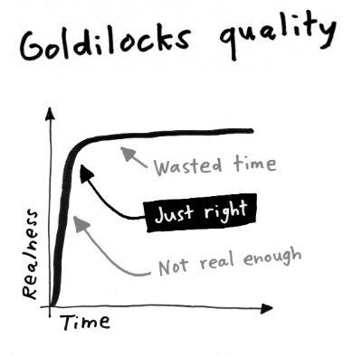
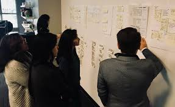

# Fulbright-Nehru Lectures
## 09 Prototype

Chancellor T. Pascale
Fulbright-Nehru
Summer 2022

-------------------------------

# Fake it

- Building the real thing is costly but a facade is cheap to make
- The more time spent on building something:
    - the less you are willing to change it
    - the more expensive it is to change it
- Start buy building a prototype and test with users
[1]

-------------------------------

# Prototypes

"
1. Anything can be prototyped
2. Prototypes are disposable
3. Build enough to learn, but no more
4. The prototype should appear real
" [1]

The goal is to be spend just enough time to appear real and to test out your idea.

-------------------------------

# Prototyping

1. Pick the right tool
2. Divide and Conquer
3. Prep

[1]

-------------------------------

# Divide and Conquer

Take your team and split up the work:

- 2 Makers - They create components
- 1 Stitcher - Weaves the components together
- 1 Writer - Creates the dialog/demo script
- 1 or more Asset Collector - Finds things the Makers need
- 1 Interviewer

Product Owner and Notetakers keep their job

[1]

-------------------------------

# Prep for tomorrow

- Stitch everything together
- Do at least 1 dry run with the Interviewer as the audience
- The Interviewer needs to know the product and the sprint goal very well

[1]

-------------------------------

# Bibliography

1. Knapp, J. Sprint; Penguin Books: London, 2021.