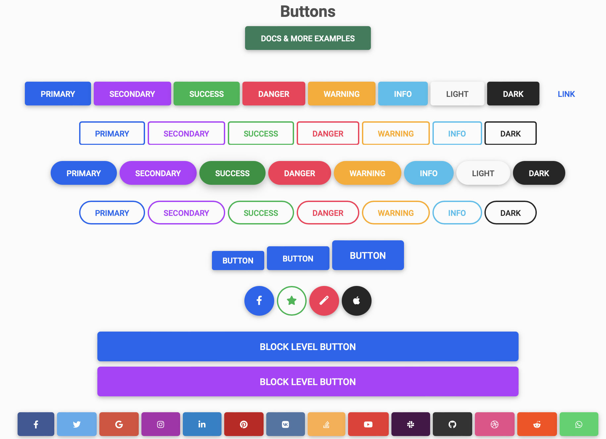
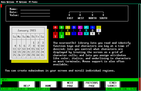
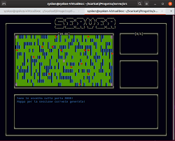
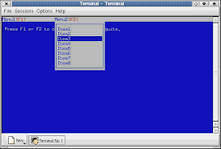
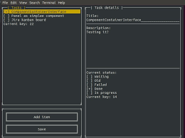

# Fulbright-Nehru Lectures
## 10 UI Frameworks

Chancellor T. Pascale
Fulbright-Nehru
Summer 2022

-------------------------------

# Why should I use a UI Framework?

- Visual Coherence
- Common Functionality
- The more you can use the better the connectivity between components
- Encapsulation
- You don't have to write all of the code yourself

-------------------------------

# Common Frameworks by Class/Language

- Java - Swing, AWT, SWT, and JavaFX
- Web - Material, Bootstrap, Foundation, One-Nexus, Vaadin
- Mobile - React Native, Ionic, Ext JS, Flutter
- C/C++ - wxWidgets, Qt,TK,  GTK+, Boost.UI, Ncurses

-------------------------------

-------------------------------

# Okay so we've already decided you would use Ncurses

- It's based on curses library, which is used by vim and other classic Unix/Linux applications
- Text-based UI framework
- There are lots of ports and frameworks that build upon or emulate its look and feel
- It's been around since 1991 (yes it is quite old)
- The official website is [here](https://invisible-island.net/ncurses/) and [GitHub](https://github.com/mirror/ncurses)

-------------------------------

-------------------------------

# How do I get it and use it

- Get the source code via git or download directly
- Ensure that you have `make` installed
- Run the following commands:
    1. `./configure`
    2. `make`
    3. `make install`
- There are many configuration and build options but probably good with the defaults

-------------------------------

# How do I make a UI from this?

- There is a great (yet old) [page](https://tldp.org/HOWTO/NCURSES-Programming-HOWTO/) with tons of detail
- This will not be super easy, so design of components and interactivity is important
- Everything starts with a window
- Then you want to combine windows into panels, think of it as a view/mode
- You will need to manage keyboard/mouse interaction
- Create menus as needed and associate with windows
- There are forms to combining inputs to a number of fields into one "object"
- You might want to consider the Curses Development Kit which includes widgets

-------------------------------

# So let's walk through the design of a UI

1. Consider your views, think of each distinct state
2. For each view, consider the windows that make up the view
    - Windows can be shared between views
3. You will need to create a state diagram and determine all of the transitions between views
4. Centralized control (file menu, etc.) should always be visible, so menus attached to the same place in Panels, etc.
5. Design your windows
    - Aim to make them only dependent on either a central state/api or events (keyboards/mice)
    - If a widget exists for what a window will do, don't reinvent the wheel
    - Once you have identified the UI components that you will use/write determine inputs and any outputs

-------------------------------

-------------------------------

# Designing Components

- Use relative coordinates (x, y, height, width) and ensure they are externally available
- Extend existing components, create your own with common state and access patterns
- Keep the view of the data and its representation separate
- Determine if you want to refresh components on an interval or be interrupt/event driven
- Either use common view state across components or externalize anything about your components that might be changed from outside
- Keep interactions, data, etc. as simple as possible. Brittle UIs don't last.
