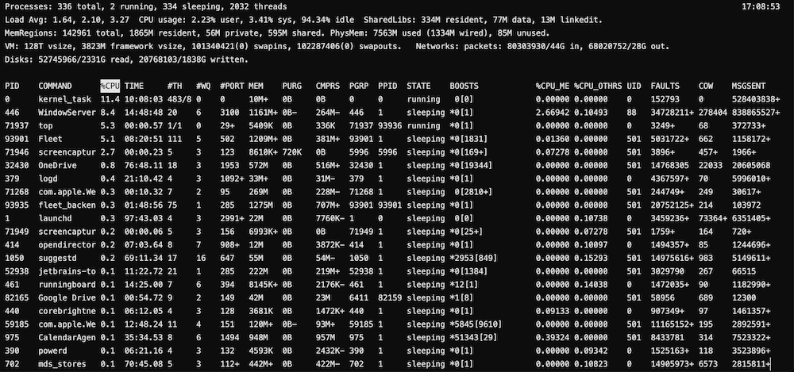
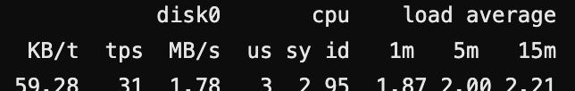
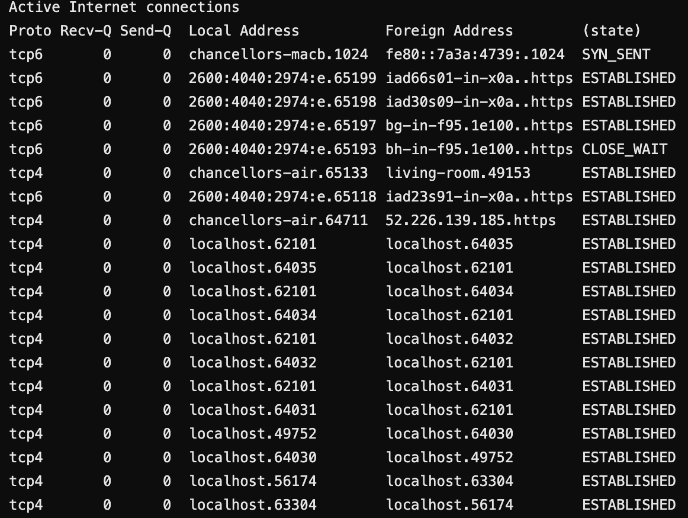

# Fulbright-Nehru Lectures
## 16 Threads and System Performance

Chancellor T. Pascale
Fulbright-Nehru
Summer 2022

-------------------------------
# Process Management and Performance Montioring Commands

- ps
- top
- kill/killall
- nohup
- iostat
- netstat

-------------------------------
# ps Command

- `ps [-options]` - Get the status of running processes
    - `-a` - Look at all processes (not just your own)
    - `-u` - Include username in the results
- A great tool for looking for specific processes
- `ps aux | grep '<process search>'` - A good way to find a specific type of process
- Can search by command such as `python`, `docker`, or `tomcat`

-------------------------------
# top Command

- `top` - Display a sorted list of processes (by default those using the most CPU)
- Will need to kill, freeze, or quit for command to exit

-------------------------------
# kill/killall Commands

- `kill <-signal_name or number> pid` - Terminate/Send a signal to a running process
    - `-1` - Kill all processes if super user
    - `-2` - interrupt
    - `-3` - quit
    - `-9` - kill
- `killall` - Like above but instead of pid, kill by process name
    - Good for killing processes based service, processing language, cli tool (e.g. java, docker, etc.)

-------------------------------
# nohup command

- `nohup <command to execute>` - Executes the command that cannot be "hung up" via SIGHUP
- Appends the standard output (not stderr) to nohup.out
- Combined with putting the command in the background and tailing (with -f) nohup.out is a good way to track command output but not lose it as buffer is overrun.
- Can also be filtered for certain errors, etc.

-------------------------------
# iostat Command

- `iostat <options>` - Reports various I/O stats

-------------------------------
# netstat Command

- `netstat <options>` - Reports various networking stats and information
- Good when combined with commands like grep to find if services are running on network ports and the hostname/IP address

