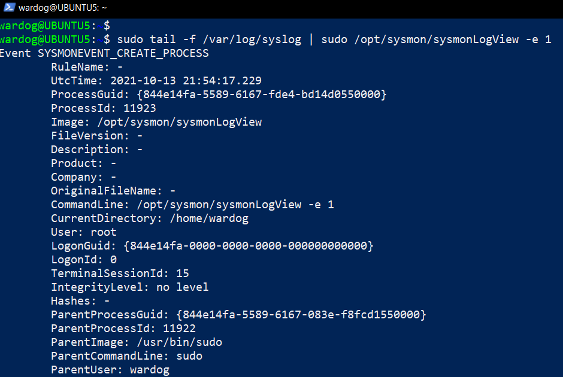

# Fulbright-Nehru Lectures
## 17 Linux Services

Chancellor T. Pascale
Fulbright-Nehru
Summer 2022

-------------------------------
## System Management Commands

- systemctl
- service
- sysmon
- Modern Package Managers and Services
- Service Filesystem

-------------------------------
## systemctl

- The most common means of controlling linux services
- systemd is the daemon for all system level services
- For anything that changes the services, need to be the root user
- `systemctl [ status | start | stop | restart ] <service-name | unit-name>`
- Without specifying any arguments, the status of all services are shown
- Note you may need to `.service` to the common name for a service

-------------------------------
## service

- An older variant of systemctl
- Works along with systemd/systemctl
- `systemctl <service | unit> [ status | start | stop | restart ]`
- In the end, shows the output of the equivalent systemctl

-------------------------------
## sysmon

- Tool that has been around for a whilem though its' level of use is probably higher on Windows
- More of an interactive tool
- `sysmon` starts the monitoring tools
- `sysmonLogView` used to process syslog files
- Extensive XML-based configuration
 [1]

-------------------------------
## Modern Package Managers and Services

- These days package managers don't just install executables or libraries
- Snap and brew, along with others, either run their own system service daemons or use ones like systemctl
- This makes the full proces of service management available in one command
- `snap [install|start|stop|restart] service-name` - Managing snaps
- `snapctl [set|get|info|reboot|services|stop|start] <service-name>` - Manages system and services in one command
- `snapcraft <-options>` - In conjunction with snap-based YAML files build packages and services
[2](https://snapcraft.io)

-------------------------------
## Service Filesystem

- `/etc/init.d` - Service daemon configuration
- `/var/log` - Service logs
- `/opt` - A good centralized location for deploying services
- `/etc/systemd/system` - services/scripts put here can be managed by systemd/systemctl

-------------------------------
## Bibliography

1. Rodriguez, R. (2021, October 14). Automating the deployment of sysmon for linux 🐧 and Azure Sentinel in a lab environment 🧪. TECHCOMMUNITY.MICROSOFT.COM. Retrieved May 22, 2022, from https://techcommunity.microsoft.com/t5/microsoft-sentinel-blog/automating-the-deployment-of-sysmon-for-linux-and-azure-sentinel/ba-p/2847054
2. https://snapcraft.io